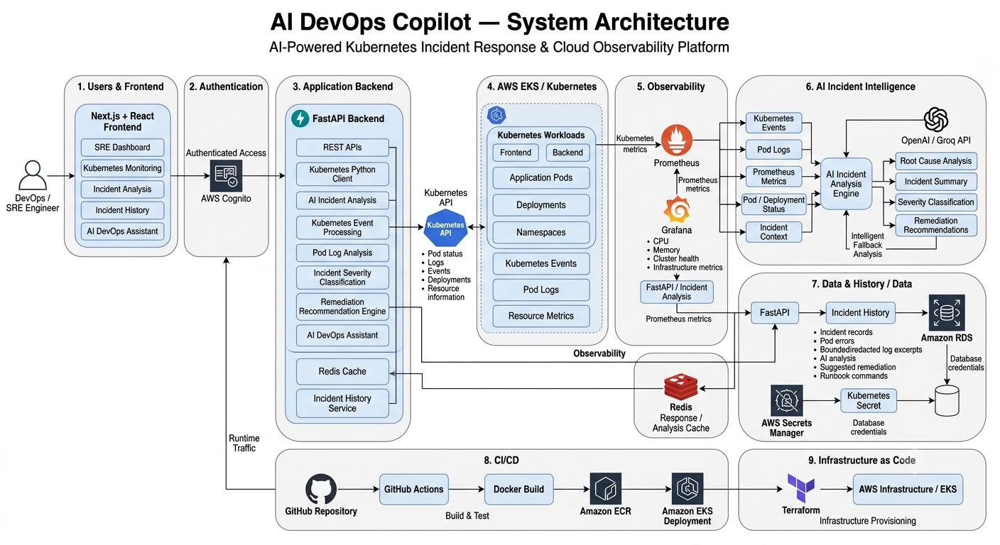

# AI DevOps Copilot

AI DevOps Copilot is an AI-powered Kubernetes incident response and cloud observability platform that helps DevOps and Site Reliability Engineering (SRE) teams detect, analyze, and troubleshoot infrastructure issues in real time.

The platform combines Kubernetes monitoring, AI-assisted root cause analysis, observability, cloud infrastructure automation, and an intelligent DevOps assistant into a unified dashboard.

---

## Live Demo

**Public read-only EKS demo**

[Open the live workload demo](http://aff79ec20ff6d48b88edc9b9831378e1-eb5b31eae7e85162.elb.ap-south-1.amazonaws.com/demo)

The public demo shows live pod and deployment readiness in the EKS `ai-devops`
namespace. It is read-only and does not expose logs, incident history,
credentials, or remediation controls. The full Cognito-authenticated dashboard
remains private and is accessed through the documented `kubectl port-forward`
workflow.

The showcase currently uses an AWS-provided load-balancer hostname over HTTP;
it does not require a custom domain, but the internet-facing load balancer
incurs ongoing AWS charges.

**Demo Video**

https://www.loom.com/share/d082add2d7614f49ace15fdf76da52d9

**GitHub Repository**

https://github.com/Axddi/ai-devops-copilot

---

# Features

## Kubernetes Monitoring

- Real-time Kubernetes cluster monitoring
- Namespace and pod management
- Resource utilization monitoring
- Cluster health overview
- Deployment status tracking
- Kubernetes event visualization

## AI Incident Analysis

- AI-powered root cause analysis
- Kubernetes event correlation
- Pod log analysis
- Incident severity classification
- Actionable remediation recommendations
- Intelligent fallback analysis when AI services are unavailable

## Observability

- Prometheus metrics collection
- Grafana dashboards
- CPU and memory monitoring
- Cluster performance visualization
- Infrastructure health monitoring

## AI DevOps Assistant

Interactive AI assistant capable of assisting with:

- Kubernetes troubleshooting
- Docker
- AWS
- Terraform
- CI/CD pipelines
- Linux administration
- Infrastructure best practices
- DevOps workflows

## Authentication

- AWS Cognito authentication
- Secure user sessions
- Protected application routes

## Infrastructure Automation

- AWS EKS deployment
- Infrastructure provisioning using Terraform
- Docker containerization
- GitHub Actions CI/CD
- Amazon ECR image deployment

---

# Technology Stack

## Frontend

- Next.js
- React
- TypeScript
- Tailwind CSS
- shadcn/ui
- Auth.js

## Backend

- FastAPI
- Python
- OpenAI / Groq API
- Kubernetes Python Client
- Redis

## Observability

- Prometheus
- Grafana

## Cloud & Infrastructure

- AWS EKS
- AWS Cognito
- Terraform
- Docker
- Kubernetes
- Amazon ECR
- Amazon RDS

## DevOps

- GitHub Actions
- Docker
- Kubernetes
- Terraform

---

# Architecture




# Project Structure

```
ai-devops-copilot
│
├── api
│   ├── models
│   ├── routes
│   ├── services
│   ├── utils
│   └── main.py
│
├── frontend
│   ├── app
│   ├── components
│   ├── hooks
│   ├── lib
│   └── public
│
├── infra
│   ├── environments
│   ├── modules
│   ├── kubernetes
│   └── scripts
│
├── monitoring
│   ├── prometheus
│   └── grafana
│
└── .github
    └── workflows
```

---

# Getting Started

## Prerequisites

- Python 3.11+
- Node.js 20+
- Docker
- Kubernetes Cluster
- kubectl
- Terraform
- AWS CLI

---

## Clone Repository

```bash
git clone https://github.com/Axddi/ai-devops-copilot.git

cd ai-devops-copilot
```

---

## Backend Setup

```bash
cd api

python -m venv .venv

# Windows
.venv\Scripts\activate

# Linux/macOS
source .venv/bin/activate

pip install -r requirements.txt

uvicorn main:app --reload
```

---

## Frontend Setup

```bash
cd frontend

npm install

npm run dev
```

---

## Tests and Code Quality

The API includes 17 automated pytest regression tests covering Cognito
authentication, Kubernetes incident detection, incident-history persistence,
chat validation, and public demo access controls.

Run them from the repository root:

```bash
cd api
python -m pytest test_regressions.py -v
```

---

# Environment Variables

## Backend

```env
GROQ_API_KEY=
GROQ_MODEL=
REDIS_URL=
```

## Frontend

```env
AUTH_SECRET=

NEXTAUTH_URL=http://localhost:3000

COGNITO_CLIENT_ID=

COGNITO_ISSUER=

NEXT_PUBLIC_COGNITO_CLIENT_ID=
```

---

## Incident history and RDS

The dashboard History section stores authenticated-user incident records: pod errors, bounded/redacted log excerpts, analysis, suggested remediation steps, and runbook commands. Suggestions are never executed.

Provisioning and connection steps are documented in [INCIDENT_HISTORY.md](./INCIDENT_HISTORY.md); Cognito setup is in [AUTHENTICATION.md](./AUTHENTICATION.md). Configure `DATABASE_URL` from the RDS-managed Secrets Manager credentials in the separate `ai-devops-db-secrets` Kubernetes Secret. Never commit database credentials. Terraform plan/validation do not provision infrastructure; review and apply from an environment with the correct Terraform state configured.

# Deployment

The platform is designed for cloud-native deployment on AWS.

Deployment workflow:

1. Provision infrastructure using Terraform
2. Create Amazon ECR repositories
3. Build Docker images
4. Push images to Amazon ECR
5. Deploy workloads to Amazon EKS
6. Configure Prometheus and Grafana
7. GitHub Actions automates the CI/CD pipeline

---


# Contributing

Contributions are welcome.

If you would like to contribute:

1. Fork the repository.
2. Create a feature branch.
3. Commit your changes.
4. Push your branch.
5. Open a Pull Request.

---

# License

This project is licensed under the MIT License.

---

# Author

**Aaditya Saxena**

GitHub: https://github.com/Axddi

LinkedIn: https://www.linkedin.com/in/aadityasaxena/

---

If you find this project useful, consider giving it a star.
